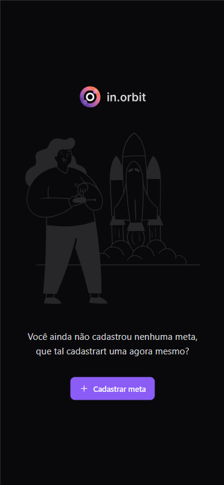

Aqui está o README atualizado para o frontend **nlw-pocket-js-react-in.orbit**:


---


# NLW Pocket JS React Frontend - in.orbit


Este repositório contém o frontend da aplicação **NLW Pocket 1.0 - in.orbit**, desenvolvida utilizando React e Tailwind CSS.


## Exemplos Visuais


### Tela Inicial
<div style="display: flex; flex-wrap: wrap; gap: 10px;">
    
    


### Tela de Metas Completadas


   
</div>


## Tecnologias Utilizadas


[](https://reactjs.org/docs/getting-started.html)
[](https://tailwindcss.com/docs)
[](https://vitejs.dev/guide/)
[](https://www.typescriptlang.org/docs/)
[](https://tanstack.com/query/latest/docs/react/overview)
[](https://react-hook-form.com/get-started)
[](https://www.radix-ui.com/)
[](https://biomejs.dev/)
[](https://lucide.dev/)
[](https://day.js.org/)
[](https://zod.dev/)


## Passos para Configuração


### 1. Clone o repositório:


```bash
git clone https://github.com/danielstos/nlw-pocket-js-react-in.orbit.git
```


### 2. Acesse a pasta do projeto:


```bash
cd nlw-pocket-js-react-in.orbit
```


### 3. Instale as dependências:


```bash
npm install
```


## Inicialização


### Frontend


Inicie o servidor de desenvolvimento:


```bash
npm run dev
```


A aplicação estará disponível em `http://localhost:5173`.


### Backend


O backend da aplicação está disponível neste repositório: **nlw-pocket-js-node-in.orbit**. Certifique-se de rodá-lo para que a aplicação frontend funcione corretamente.


Para rodar o backend:


1. Clone o repositório backend:


   ```bash
   git clone https://github.com/danielstos/nlw-pocket-js-node-in.orbit.git
   ```


2. Acesse a pasta do backend e siga as instruções no README para configurar e iniciar o servidor.


## Estrutura de Pastas


```bash
nlw-pocket-js-react-in.orbit/
├── .vscode/
│   ├── settings.json             # Configurações específicas do VSCode
├── node_modules/                 # Módulos e dependências instaladas
├── public/                       # Arquivos públicos estáticos (HTML, imagens)
├── src/
│   ├── assets/
│   │   ├── lets-start-illustration.svg   # Ilustração inicial
│   │   ├── logo-in-orbit.svg             # Logo da aplicação
│   ├── components/
│   │   ├── create-goal.tsx               # Componente para criar metas
│   │   ├── empty-goals.tsx               # Componente de metas vazias
│   │   ├── in-orbit-icon.tsx             # Ícone da aplicação
│   │   ├── pending-goals.tsx             # Exibe as metas pendentes
│   │   ├── summary.tsx                   # Resumo de metas
│   │   ├── ui/                           # Componentes de UI reutilizáveis
│   │   │   ├── button.tsx                # Botão customizado
│   │   │   ├── dialog.tsx                # Diálogo de confirmação
│   │   │   ├── input.tsx                 # Campo de input
│   │   │   ├── label.tsx                 # Label para inputs
│   │   │   ├── outline-button.tsx        # Botão com borda
│   │   │   ├── progress-bar.tsx          # Barra de progresso
│   │   │   ├── radio-group.tsx           # Componente de grupo de opções (radio)
│   │   │   ├── separator.tsx             # Separador visual
│   ├── http/                             # Funções para chamadas HTTP
│   │   ├── create-goal-completion.ts     # Função para completar uma meta
│   │   ├── create-goal.ts                # Função para criar uma meta
│   │   ├── get-pending-goals.ts          # Função para obter metas pendentes
│   │   ├── get-summary.ts                # Função para obter o resumo semanal
│   ├── app.tsx                           # Componente raiz da aplicação
│   ├── index.css                         # Estilos globais da aplicação
│   ├── main.tsx                          # Arquivo de entrada do React
│   ├── vite-env.d.ts                     # Tipos para o Vite
│   ├── index.html                        # HTML principal
├── .gitignore                            # Arquivos e pastas a serem ignorados pelo Git
├── biome.json                            # Configuração do Biome
├── package.json                          # Dependências e scripts da aplicação
├── package-lock.json                     # Versões exatas das dependências instaladas
├── tsconfig.app.json                     # Configurações de compilação do TypeScript
├── tsconfig.node.json                    # Configurações TypeScript para Node.js
├── vite.config.ts                        # Configuração do Vite
├── tailwind.config.js                    # Configuração do Tailwind CSS
├── postcss.config.js                     # Configuração do PostCSS
```


## Contribuição


Sinta-se à vontade para contribuir com melhorias ou correções. Para isso, faça um fork do repositório, crie uma nova branch e abra um **Pull Request** com as alterações.


---


